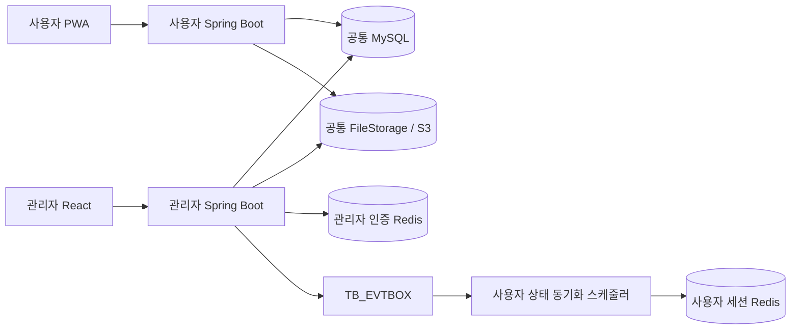

# Sadari Admin

Sadari Admin은 [Sadari 사용자 서비스](https://github.com/hwaiplay/sadari)의 메뉴·공통 코드·알림·운영 콘텐츠·회원 상태를 관리하는 운영 웹 애플리케이션입니다. 단순 조회·수정 화면에 머무르지 않고, 사용자 앱을 다시 배포하지 않아도 운영 정책을 변경하고 그 결과를 안전하게 사용자 서비스에 전달하는 구조를 목표로 개발했습니다.

## 프로젝트 정보

| 항목 | 내용 |
| --- | --- |
| 개발 기간 | 2026.07 ~ 진행 중 |
| 개발 형태 | Sadari 팀 프로젝트의 관리자 서비스 |
| 서비스 구성 | 관리자 React 화면, Spring Boot API, 공통 MySQL·파일 저장소 |
| 주요 기여 영역 | 권한 관리, 운영 콘텐츠, 사용자 정지, 스케줄러 로그, 알림 아이콘 |
| 연동 서비스 | [hwaiplay/sadari](https://github.com/hwaiplay/sadari) |

## 기술 스택

| 구분 | 기술 |
| --- | --- |
| Backend | Java 17, Spring Boot 4.1.0, Spring MVC, Spring Security, MyBatis 4.0.0 |
| Data | MySQL, Redis, HikariCP |
| Frontend | React 19, TypeScript 6.0, Vite 8, Summernote, jQuery |
| Storage | Local File Storage, AWS SDK for Java 2.x, Private S3 |
| API | REST API, Bean Validation, OpenAPI 3, Swagger UI |
| Build | Gradle, npm, ESLint |

## 핵심 성과

| 해결 과제 | 적용 내용 | 운영 효과 |
| --- | --- | --- |
| 앱 재배포 없는 운영 변경 | 사용자 메뉴·공통 코드·알림 템플릿을 관리자에서 관리 | 메뉴 노출과 운영 문구를 데이터 변경으로 반영 |
| 작성본과 사용자 노출본 분리 | 공지사항·서비스 정보를 버전과 배포 상태로 관리 | 작성 중 콘텐츠의 사용자 노출 방지와 배포 이력 추적 |
| 회원 상태의 세션 정합성 | DB 변경과 Outbox 이벤트를 같은 트랜잭션에 저장 | 관리자 DB 변경을 사용자 Redis까지 재시도 가능하게 전달 |
| 관리자 접근 통제 | Redis 인증 필터와 메뉴 권한 인터셉터 적용 | 화면 숨김뿐 아니라 API 직접 접근도 권한별 제한 |
| 배치 운영 가시성 | 사용자 서비스의 실행·실패 로그를 읽기 전용으로 조회 | 처리 건수·실행 시간·대표 실패 원인 확인 |
| 파일 일관성 | 사용자 서비스와 동일한 `FileStorage`·객체 키 사용 | 프로필·배경·공지 이미지를 두 서비스에서 동일하게 제공 |

## 주요 기능

| 영역 | 제공 기능 |
| --- | --- |
| 인증과 권한 | 관리자 로그인, Redis 세션 인증, 권한 그룹과 메뉴별 접근 권한 관리 |
| 메뉴·공통 코드 | 관리자·사용자 메뉴의 계층·순서·노출 상태와 세부 코드 관리 |
| 알림 | 상황별 템플릿, 이동 링크와 알림 아이콘 관리 |
| 운영 콘텐츠 | 공지사항, 팝업, 서비스 정보의 작성·수정·버전·배포 관리 |
| 사용자 | 회원 정보·활동 이력 조회, 계정 상태와 정지 이력 관리 |
| 신고 | 신고 내역 조회, 처리 상태 변경과 대상 사용자 제재 연계 |
| 스케줄러 | 사용자 백엔드 배치의 실행 이력과 실패 상세 조회 |
| 파일 | 로컬 파일 시스템 또는 Private S3 기반 이미지 저장·조회 |

## 사용자 서비스 연동 구조

관리자 서비스와 사용자 서비스는 서로의 REST API를 직접 호출하지 않습니다. 공통 MySQL 업무 테이블과 파일 저장소를 사용하며, 회원 세션에 영향을 주는 상태 변경은 DB Outbox를 통해 사용자 백엔드에 전달합니다.



공유 DB는 동기 API 의존성과 관리자 장애의 사용자 요청 전파를 줄이지만, 두 서비스가 같은 스키마에 결합되는 비용이 있습니다. 이를 통제하기 위해 다음 기준을 적용합니다.

- 스키마와 운영 기준 데이터의 원본은 사용자 저장소의 `scripts/db/mysql`에서 관리합니다.
- 테이블별 쓰기 주체를 구분하고 사용자 Redis는 사용자 백엔드만 변경합니다.
- 관리자 변경이 사용자 세션에 영향을 주면 같은 DB 트랜잭션에 Outbox 이벤트를 저장합니다.
- 서비스와 팀 규모가 커져 독립적인 스키마 변경이 중요해지면 도메인 API 또는 이벤트 계약으로 분리할 수 있습니다.

## 사용자 서비스 적용 범위

| 관리자 기능 | 공통 데이터 | 사용자 서비스 적용 방식 |
| --- | --- | --- |
| 사용자 메뉴 | `TM_URMENU` | 사용자 백엔드가 활성 메뉴 트리를 조회하여 PWA 헤더와 설정 메뉴에 반영합니다. |
| 공통 코드 | `TM_CODEXM`, `TB_CODEXD` | 카테고리, 상태명, 알림 상황과 서비스 정보 구분에 사용합니다. |
| 알림 템플릿 | `TB_ALTEMP` | 알림 생성 시 활성 템플릿의 `#{key}` 값을 치환하여 `TB_ALIMXX`에 저장합니다. |
| 알림 아이콘 | `TM_ALICON` | 알림 조회 시 상황별 아이콘을 결합하고 미등록 상황에는 기본 아이콘을 사용합니다. |
| 팝업 | `CT_POPUPX` | 활성 상황과 팝업 코드를 기준으로 사용자 PWA에 노출합니다. |
| 공지사항 | `CT_NOTICE` | `DPLY_YSNO = 'Y'`인 배포 버전만 목록과 상세 화면에 노출합니다. |
| 서비스 정보 | `CT_SVINFO` | `DPLY_YSNO = 'Y'`인 배포 버전만 설정 화면에 노출합니다. |
| 사용자 정지 | `TM_USERXM`, `TH_USSPND`, `TB_EVTBOX` | 사용자 스케줄러가 이벤트를 소비하여 PWA 접근 제한과 Redis 상태를 동기화합니다. |
| 스케줄러 로그 | `TL_SCLOGX`, `TL_SCFAIL` | 사용자 백엔드가 기록한 배치 결과를 관리자가 읽기 전용으로 조회합니다. |
| 공통 파일 | `TM_FILEXM`, `notice/*`, `profile/*`, `background/*` | 동일한 파일 저장소와 객체 키로 사용자·관리자 화면에 이미지를 제공합니다. |

## 핵심 운영 사례

### 1. 운영 콘텐츠를 버전과 배포 상태로 관리

공지사항과 서비스 정보는 저장 즉시 사용자에게 노출하지 않습니다. 관리자가 여러 버전 중 하나를 배포하면 기존 배포본을 해제하고 선택한 버전의 `DPLY_YSNO`를 `Y`로 변경합니다. 사용자 백엔드는 배포된 버전만 조회합니다.

등록자·수정자·배포자와 각 처리 일시를 별도로 기록하여 콘텐츠의 작성 과정과 실제 사용자 노출 시점을 구분합니다.

```text
작성 → 저장(미배포 버전) → 검토 → 배포
                              ├─ 기존 배포본 DPLY_YSNO = N
                              └─ 선택 버전 DPLY_YSNO = Y
                                              ↓
                                  사용자 서비스 조회 대상
```

같은 콘텐츠 또는 같은 서비스 정보 구분에서 배포본이 둘 이상 생기지 않도록 기존 배포 해제와 신규 배포를 하나의 트랜잭션으로 처리합니다. 편집 중인 버전은 보존되므로 운영자는 사용자에게 노출되는 문구를 유지한 채 다음 버전을 준비할 수 있습니다.

- [공지사항 서비스](src/main/java/org/sadari/admin/sadariadmin/notice/service/impl/NoticeServiceImpl.java)
- [공지사항 쿼리](src/main/java/org/sadari/admin/sadariadmin/notice/mapper/NoticeMapper.xml)
- [서비스 정보 서비스](src/main/java/org/sadari/admin/sadariadmin/serviceinfo/service/impl/ServiceInfoServiceImpl.java)
- [서비스 정보 쿼리](src/main/java/org/sadari/admin/sadariadmin/serviceinfo/mapper/ServiceInfoMapper.xml)

### 2. 회원 상태를 DB Outbox로 사용자 세션까지 동기화

관리자가 사용자를 정지하면 다음 변경을 하나의 DB 트랜잭션에서 처리합니다.

```text
TM_USERXM.USER_STAT 변경
  → TH_USSPND 정지 이력 저장
  → TB_EVTBOX에 USER_STATUS_CHANGED 등록
  → 사용자 백엔드가 최신 DB 상태 조회
  → 사용자 Redis 상태 갱신
  → 사용자 PWA 접근 제한
```

사용자 백엔드는 Redis 반영에 성공한 이벤트만 삭제합니다. 실패 이벤트는 다음 실행에서 재처리하며, 빠르게 연속된 정지·해제 이벤트도 처리 시점의 최신 DB 상태로 수렴합니다.

정지 이력에는 기간과 사유를 별도로 남기고, 사용자 원본 상태와 Outbox 등록이 함께 실패하거나 함께 성공하도록 경계를 정했습니다. 관리자가 사용자 Redis에 직접 접근하지 않기 때문에 두 애플리케이션의 인증 책임도 섞이지 않습니다.

- [사용자 상태 관리 서비스](src/main/java/org/sadari/admin/sadariadmin/currentuser/service/impl/CurrentUserServiceImpl.java)
- [사용자 상태 쿼리](src/main/java/org/sadari/admin/sadariadmin/currentuser/mapper/CurrentUserMapper.xml)
- [사용자 프로젝트 Outbox 소비 서비스](https://github.com/hwaiplay/sadari/blob/sprint/26.07/src/main/java/org/our/sadari/global/scheduler/service/UserStatusEventServiceImpl.java)

### 3. 관리자 인증과 메뉴 권한을 함께 검증

관리자 로그인 토큰은 Redis 세션으로 관리하고 `RedisAuthenticationFilter`가 요청마다 인증 정보를 복원합니다. 인증 이후에는 `MenuPermissionInterceptor`가 API 경로에 연결된 관리자 메뉴와 권한을 확인합니다.

프론트엔드의 메뉴 숨김만 신뢰하지 않고 서버에서 직접 URL 접근도 차단합니다. 권한 그룹과 메뉴의 관계는 관리자 화면에서 관리하며, 등록자·수정자 정보는 `FN_GET_ADMIN_NAME`으로 일관되게 조회합니다.

- [Redis 인증 필터](src/main/java/org/sadari/admin/sadariadmin/config/RedisAuthenticationFilter.java)
- [메뉴 권한 인터셉터](src/main/java/org/sadari/admin/sadariadmin/config/MenuPermissionInterceptor.java)
- [권한 그룹 쿼리](src/main/java/org/sadari/admin/sadariadmin/authgroup/mapper/AuthGroupMapper.xml)

### 4. 알림 템플릿과 아이콘의 책임 분리

관리자는 `TB_ALTEMP`에서 알림 문구와 이동 링크를, `TM_ALICON`에서 상황별 아이콘을 관리합니다. 사용자 백엔드는 알림이 발생할 때 활성 템플릿으로 실제 알림을 생성하고, 목록 조회 시 상황 코드에 맞는 아이콘을 결합합니다.

문구와 이동 경로는 알림 생성 시점에 확정되며 아이콘은 조회 시점에 적용되므로, 아이콘 변경은 기존 알림 목록에도 반영할 수 있습니다.

- [알림 템플릿 쿼리](src/main/java/org/sadari/admin/sadariadmin/alim/mapper/AlimTempMapper.xml)
- [알림 아이콘 쿼리](src/main/java/org/sadari/admin/sadariadmin/alimicon/mapper/AlimIconMapper.xml)
- [사용자 프로젝트 알림 서비스](https://github.com/hwaiplay/sadari/blob/sprint/26.07/src/main/java/org/our/sadari/alim/service/AlimServiceImpl.java)

### 5. 메뉴와 공통 코드로 사용자 앱의 기준 정보를 운영

사용자 메뉴는 최대 3단계 계층, 상위 메뉴, 노출 순서, 사용 여부를 관리합니다. 사용자 백엔드는 활성 메뉴만 트리로 조립하므로 메뉴 명칭이나 순서를 바꿀 때 PWA를 다시 빌드하지 않아도 됩니다. 저장 시에는 자기 자신을 상위 메뉴로 지정하거나 허용 깊이를 넘는 구조를 서버에서 차단합니다.

공통 코드는 코드 마스터와 상세 코드로 분리하고 상위 코드 관계, 사용 여부와 정렬 순서를 관리합니다. 카테고리·회원 상태·알림 상황처럼 두 서비스가 공유하는 값은 화면에 문자열로 중복 선언하지 않고 코드 조회 결과를 사용합니다.

- [사용자 메뉴 서비스](src/main/java/org/sadari/admin/sadariadmin/usermenu/service/impl/UserMenuServiceImpl.java)
- [사용자 메뉴 쿼리](src/main/java/org/sadari/admin/sadariadmin/usermenu/mapper/UserMenuMapper.xml)
- [공통 코드 쿼리](src/main/java/org/sadari/admin/sadariadmin/common/code/mapper/CodeMapper.xml)

### 6. 사용자 배치 결과를 읽기 전용 운영 정보로 제공

회원 상태 동기화와 영구 삭제 같은 배치는 사용자 백엔드가 실행하고 `TL_SCLOGX`, `TL_SCFAIL`에 결과를 기록합니다. 관리자 서비스는 실행 번호, 스케줄러 코드, 시작·종료 상태, 처리·성공·실패 건수와 소요 시간을 조회하며 실패 건은 대표 원인과 대상 정보를 별도 화면에서 확인합니다.

실행 책임은 사용자 서비스에, 관찰 책임은 관리자 서비스에 두었습니다. 관리자가 배치를 임의 실행하거나 로그를 수정하지 않으므로 운영 화면이 업무 처리의 새로운 실패 지점이 되지 않습니다.

- [스케줄러 로그 서비스](src/main/java/org/sadari/admin/sadariadmin/schedulelog/service/impl/ScheduleLogServiceImpl.java)
- [스케줄러 로그 쿼리](src/main/java/org/sadari/admin/sadariadmin/schedulelog/mapper/ScheduleLogMapper.xml)

### 7. 공통 파일 저장소의 객체 키를 두 서비스에서 동일하게 해석

파일 메타데이터는 `TM_FILEXM`에서 관리하고 물리 파일은 환경에 따라 로컬 저장소 또는 Private S3에 보관합니다. 프로필·배경·공지처럼 허용된 디렉터리와 UUID 객체 키 규칙을 두 서비스가 공유하여, 관리자가 등록한 공지 이미지와 사용자가 등록한 프로필을 어느 화면에서도 같은 파일로 조회합니다.

두 애플리케이션의 로컬 저장 루트나 S3 prefix가 다르면 DB에 같은 파일 번호가 있어도 한쪽에서는 기본 이미지로 대체되는 문제가 발생할 수 있습니다. 따라서 저장 구현뿐 아니라 환경별 bucket·prefix·조회 경로를 하나의 연동 계약으로 취급하고, 존재하지 않는 객체는 통제된 404 또는 기본 이미지 정책으로 처리합니다.

- [파일 저장소 계약](src/main/java/org/sadari/admin/sadariadmin/file/storage/FileStorage.java)
- [로컬 파일 저장소](src/main/java/org/sadari/admin/sadariadmin/file/storage/LocalFileStorage.java)
- [S3 파일 저장소](src/main/java/org/sadari/admin/sadariadmin/file/storage/S3FileStorage.java)

## 실패 처리와 트랜잭션 경계

| 상황 | 처리 기준 |
| --- | --- |
| 운영 콘텐츠 배포 중 실패 | 기존 배포 해제와 신규 배포를 함께 롤백하여 사용자 노출본을 잃지 않습니다. |
| 사용자 정지 저장 중 실패 | 사용자 상태, 정지 이력과 Outbox 이벤트를 같은 트랜잭션으로 롤백합니다. |
| 사용자 Redis 반영 실패 | 관리자 요청에서 Redis를 직접 변경하지 않고 Outbox를 보존해 사용자 스케줄러가 재시도합니다. |
| 공통 파일을 찾지 못함 | 저장소 경로를 임의 보정하지 않고 기본 이미지 또는 통제된 오류 응답 정책을 적용합니다. |
| 권한 없는 API 직접 호출 | 화면 노출 여부와 무관하게 서버 인터셉터에서 메뉴 권한을 검증하고 차단합니다. |

이 기준은 “관리 화면에서 저장 버튼이 성공했다”는 사실과 “사용자 서비스에 안전하게 적용되었다”는 사실을 구분하기 위한 것입니다. DB 원자성으로 해결할 수 있는 범위와 외부 저장소·Redis처럼 재시도 또는 대체 응답이 필요한 범위를 분리했습니다.

## 테스트와 보안

- 사용자 메뉴, 공통 코드, 공지사항, 팝업, 서비스 정보, 사용자 정지, 신고, 알림 아이콘과 파일 저장소 테스트를 `src/test`에서 관리합니다.
- 관리자 API는 Redis 인증과 메뉴 권한을 모두 통과해야 접근할 수 있습니다.
- Swagger와 OpenAPI 문서도 관리자 권한이 있는 요청에만 공개합니다.
- 비밀번호, Redis 비밀번호, AWS 접근 키와 운영 DB 접속 정보는 저장소에 포함하지 않습니다.
- 현재 관리자 저장소에는 독립적인 GitHub Actions 검증 워크플로가 없습니다. CI 도입 전까지 로컬 테스트·빌드 결과에 의존하는 한계가 있습니다.

## 현재 한계와 개선 방향

| 현재 한계 | 개선 방향 |
| --- | --- |
| 관리자 저장소에 독립 CI가 없음 | 백엔드 테스트와 프론트엔드 lint·typecheck·build를 PR 필수 검사로 구성 |
| 공통 DB로 서비스 간 스키마 결합이 존재함 | 변경 빈도 증가 시 도메인별 API·이벤트 계약으로 단계적 분리 |
| 사용자 신고 화면과 저장 API가 연결되지 않음 | 사용자 신고 등록 API와 `TH_CMPLNT` 저장·관리 처리 흐름 완성 |
| 운영 변경의 전체 감사 로그가 도메인별 컬럼에 분산됨 | 중요 설정의 변경 전후 값과 처리자를 기록하는 통합 감사 이력 검토 |

## 저장소 구조

```text
sadari-admin
├─ src/main/java/org/sadari/admin/sadariadmin
│  ├─ admin, adminauth, menu       관리자 계정·인증·메뉴
│  ├─ authgroup                    권한 그룹·메뉴별 접근 권한
│  ├─ currentuser, complaint      사용자·정지·신고 관리
│  ├─ alim, alimicon              알림 템플릿·아이콘
│  ├─ notice, popup, serviceinfo  운영 콘텐츠와 배포
│  └─ schedulelog, file           스케줄러 이력·파일 저장소
├─ src/main/frontend              React 관리자 화면
├─ src/test                       백엔드 테스트
└─ build.gradle                   백엔드 빌드 설정
```

## 관련 저장소

- 사용자 서비스: [hwaiplay/sadari](https://github.com/hwaiplay/sadari)
- 관리자 서비스: [hwaiplay/sadari-admin](https://github.com/hwaiplay/sadari-admin)
